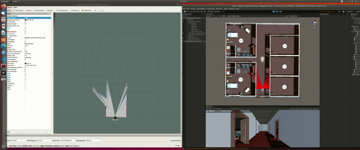
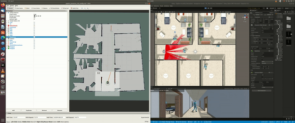
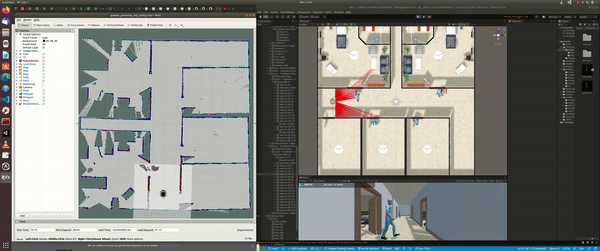
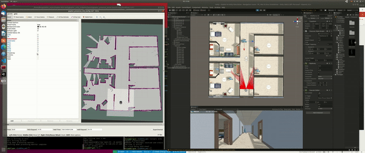

# Collision-Avoidance-of-custom-Gopher-Robot-in-Unity

Packages list:
robot description package - "gopher_description"
robot navigation package - "gopher_navigation"
MPC local planner package - "mpc_local_planner"

Steps to run the project:
1. Load Unity package Gopher-In-Unity-Simulation
2. Setup Local planners by changing parameters in config folder of "gopher_navigation" package and make required changes in "gopher_presence_server.launch" of gopher_unity_endpoint package 
3. Launch "gopher_presence_server.launch" in "gopher_unity_endpoint" package

Gopher-In-Unity-Simulation and Gopher-ROS-Unity git repositories are taken as base and modified as per our project requirement

####SLAM Gmapping
GMapping

####RESULTS - TEB Planner

####RESULTS - DWA Planner

####RESULTS - MPC Planner

